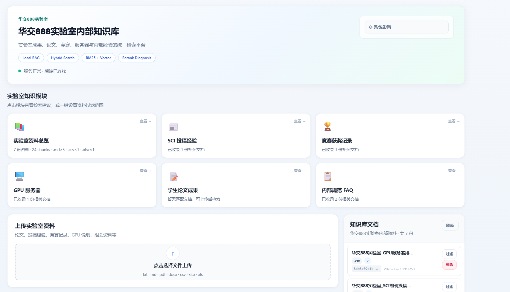
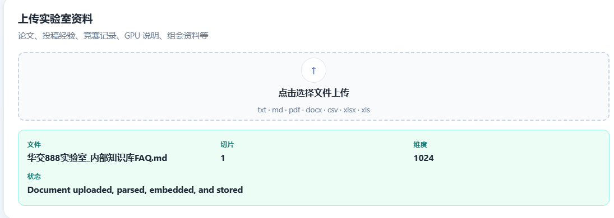
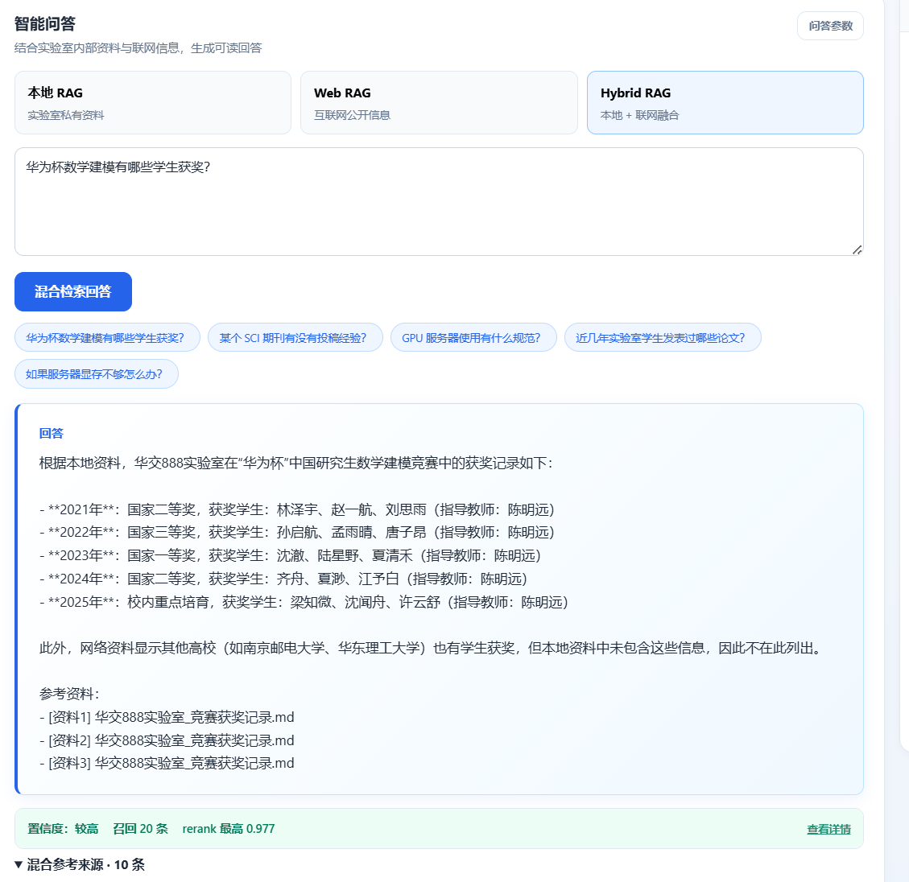
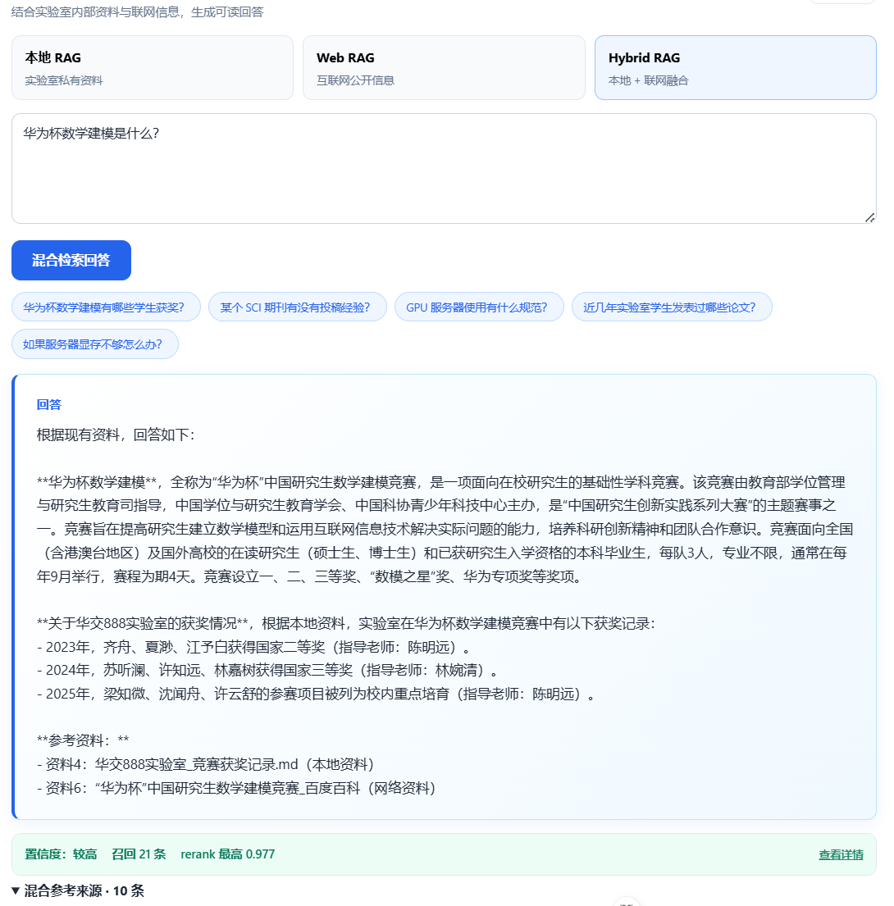
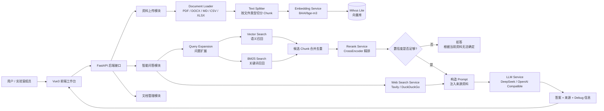
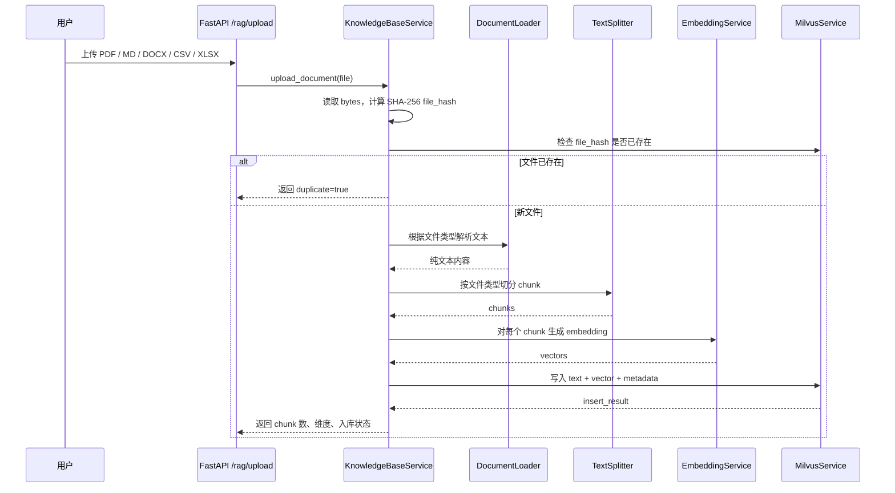
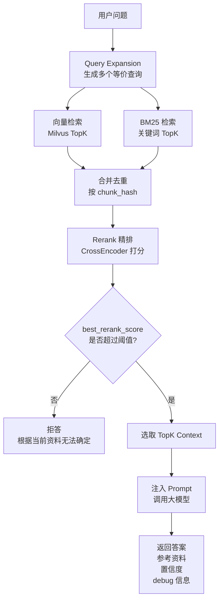
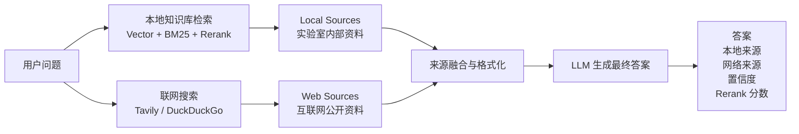

# 华交888实验室内部知识库

<p align="center">
  <strong>面向实验室成果、论文、竞赛、服务器与内部经验的统一检索问答平台</strong>
</p>

<p align="center">
  
  
  
  
  
  
</p>

---

## 1. 项目简介

本项目是一个基于 **FastAPI + Vue3 + Milvus Lite + BGE Embedding + Rerank + Web Search** 的实验室内部知识库系统。

它的目标不是做一个普通聊天机器人，而是让实验室内部沉淀的资料可以被统一检索、追问和复用，例如：

- 实验室论文成果、学生发表记录、老师项目成果；
- SCI 期刊投稿经验、审稿周期、投稿评价；
- 华为杯、数学建模、创新创业等竞赛获奖记录；
- GPU 服务器使用规范、账号管理、常见故障处理；
- 实验室内部 FAQ、组会资料、制度说明；
- 本地资料与互联网公开信息的融合问答。

核心链路可以概括为：

```text
上传资料 -> 文档解析 -> Chunk 切分 -> Embedding 向量化 -> Milvus 入库
用户提问 -> BM25 + Vector 召回 -> Rerank 精排 -> LLM 生成答案 -> 返回来源与置信度
```

---

## 2. 前端效果预览

### 2.1 首页：实验室知识模块总览

首页将知识库按实验室真实使用场景拆成多个模块：资料总览、SCI 投稿经验、竞赛获奖记录、GPU 服务器、学生论文成果、内部规范 FAQ 等。用户可以从模块进入，也可以直接使用智能问答。



### 2.2 上传资料：资料入库与状态反馈

支持上传 `.txt`、`.md`、`.pdf`、`.docx`、`.csv`、`.xlsx`、`.xls` 等文件。上传后后端会完成解析、切分、向量化和存储，并返回切片数量、Embedding 维度、入库状态等信息。



### 2.3 Hybrid RAG：本地资料 + 联网信息融合问答

系统支持三种问答模式：

| 模式 | 说明 | 适合问题 |
|---|---|---|
| 本地 RAG | 只使用实验室内部资料 | “实验室有哪些学生获得华为杯奖项？” |
| Web RAG | 只使用互联网公开信息 | “华为杯数学建模是什么比赛？” |
| Hybrid RAG | 本地资料 + 联网信息融合 | “结合实验室获奖记录，介绍华为杯数学建模情况。” |





### 2.4 前端页面生成与迭代说明

本项目的前端页面借助 **Cursor** 与 **Codex** 进行辅助生成，并不是一次性完成的静态页面，而是在后端接口逐步完善的过程中，围绕页面布局、接口字段、交互反馈、配色风格、卡片展示、结果来源展示等细节进行了多轮调节与迭代。

简单来说，前端开发过程可以概括为：

```text
后端接口完成 -> 明确页面需求 -> 使用 Cursor / Codex 生成初版页面
-> 根据实际接口返回结果调试字段 -> 调整布局和样式
-> 优化上传区、知识模块卡片、问答区域、来源展示
-> 多轮测试与修改 -> 形成当前 Vue3 前端工作台
```

在这个过程中，AI 编程工具主要承担了页面骨架生成、组件样式调整和交互逻辑补全的工作；项目的业务目标、RAG 流程、接口设计、功能取舍和最终效果，则是在不断测试后端真实返回结果的基础上逐步确定的。

---

## 3. 系统功能一览

| 功能模块 | 当前状态 | 说明 |
|---|---:|---|
| 多格式文档上传 | 已完成 | 支持 txt、md、pdf、docx、csv、xlsx、xls |
| 文件内容去重 | 已完成 | 使用 SHA-256 `file_hash` 判断重复文件 |
| 文档解析 | 已完成 | 根据不同文件类型提取纯文本 |
| Chunk 切分 | 已完成 | 按文件类型设置不同 chunk size 和 overlap |
| Embedding 向量化 | 已完成 | 默认使用 `BAAI/bge-m3` |
| Milvus Lite 向量库存储 | 已完成 | 本地轻量化向量数据库 |
| BM25 关键词检索 | 已完成 | 补充专有名词、年份、人名、缩写检索能力 |
| Vector Search 语义检索 | 已完成 | 根据语义相似度召回 chunk |
| Hybrid Search | 已完成 | BM25 + Vector 合并召回 |
| Rerank 精排 | 已完成 | 默认使用 `BAAI/bge-reranker-base` |
| 低置信度拒答 | 已完成 | 资料不足时返回“根据当前资料无法确定” |
| 本地 RAG 问答 | 已完成 | 基于实验室内部资料回答 |
| Web RAG 问答 | 已完成 | 基于 Tavily / DuckDuckGo 联网搜索回答 |
| Hybrid RAG 问答 | 已完成 | 本地资料与互联网资料融合回答 |
| 检索评测脚本 | 已完成 | 支持 Hit@5、MRR@5、关键词覆盖率等指标 |
| Vue 前端工作台 | 已完成 | 借助 Cursor / Codex 多轮辅助生成，支持上传、文档列表、智能问答、来源展示 |

---

## 4. 整体架构图



---

## 5. RAG 核心链路

### 5.1 资料上传入库流程

入口接口：

```text
POST /rag/upload
```

对应代码：

```text
app/api/rag.py
app/services/knowledge_base_service.py
```

流程如下：



文件 hash 的作用是去重：只要文件内容完全一样，即使文件名不同，也会被识别为重复文件。

### 5.2 本地 RAG 问答流程

入口接口：

```text
POST /rag/ask
```

流程如下：



这一流程对应 RAG 的经典三段式：

```text
Retrieve -> Augment -> Generate
检索      -> 增强上下文 -> 生成
```

### 5.3 混合问答流程

入口接口：

```text
POST /rag/ask-hybrid
```

混合问答会同时使用：

- 本地知识库：回答“我们实验室内部有什么资料”；
- 联网搜索：补充“外部公开资料和最新信息”。



适合的问题示例：

```text
华为杯数学建模是什么？我们实验室有哪些学生获奖？
```

系统会先从互联网解释“华为杯数学建模”的背景，再从本地知识库检索实验室自己的获奖记录。

---

## 6. 快速启动

### 6.1 后端启动

安装依赖：

```bash
pip install -r requirements.txt
```

复制环境变量文件：

```bash
cp .env.example .env
```

Windows PowerShell 可以使用：

```powershell
copy .env.example .env
```

配置 `.env`：

```env
LLM_BASE_URL=https://api.deepseek.com
LLM_API_KEY=你的 DeepSeek 或兼容 OpenAI SDK 的 API Key
LLM_MODEL=deepseek-chat

WEB_SEARCH_PROVIDER=tavily
TAVILY_API_KEY=你的 Tavily API Key

EMBEDDING_MODEL_NAME=BAAI/bge-m3
RERANK_MODEL_NAME=BAAI/bge-reranker-base
RERANK_THRESHOLD=0.55

API_KEY=可选，配置后请求需要携带 X-API-Key
```

启动 FastAPI：

```bash
uvicorn app.main:app --reload --host 0.0.0.0 --port 8000
```

接口文档：

```text
http://127.0.0.1:8000/docs
```

### 6.2 前端启动

如果前端目录为 `frontend/`，进入前端目录后执行：

```bash
cd frontend
npm install
npm run dev
```

常见 Vite 访问地址：

```text
http://127.0.0.1:5173
```

如果前端需要配置后端地址，可以在前端 `.env` 中设置：

```env
VITE_API_BASE_URL=http://127.0.0.1:8000
```

---

## 7. 目录结构

```text
fastapi_study/
├─ backend/
│  ├─ app/
│  │  ├─ api/                         # FastAPI 路由层
│  │  │  ├─ rag.py                     # RAG 核心接口
│  │  │  ├─ health.py                  # 健康检查
│  │  │  ├─ chat.py                    # 普通聊天 demo
│  │  │  ├─ file.py                    # 普通文件上传 demo
│  │  │  └─ user.py                    # 用户 demo
│  │  ├─ schemas/
│  │  │  └─ rag_schema.py              # Pydantic 请求/响应模型
│  │  ├─ services/
│  │  │  ├─ document_loader.py         # 多格式文档解析
│  │  │  ├─ text_splitter.py           # 文本切分
│  │  │  ├─ embedding_service.py       # Embedding 向量化
│  │  │  ├─ milvus_service.py          # Milvus Lite 向量库
│  │  │  ├─ bm25_service.py            # BM25 关键词检索
│  │  │  ├─ rerank_service.py          # Rerank 精排
│  │  │  ├─ knowledge_base_service.py  # 知识库上传、检索、删除
│  │  │  ├─ rag_pipeline_service.py    # RAG / Hybrid RAG 主流程
│  │  │  ├─ llm_service.py             # 大模型调用
│  │  │  ├─ web_search_service.py      # 联网搜索
│  │  │  └─ rag_utils.py               # 检索工具函数
│  │  ├─ config.py                     # .env 配置读取
│  │  ├─ main.py                       # FastAPI 应用入口
│  │  └─ security.py                   # API Key 和限流
│  ├─ eval/                            # 检索与 rerank 评测脚本
│  ├─ uploads/                         # 上传文件目录
│  ├─ milvus_demo.db/                  # Milvus Lite 本地向量库
│  ├─ requirements.txt
│  └─ .env.example
│
├─ frontend/                           # Vue3 前端工作台
│  ├─ src/
│  ├─ package.json
│  └─ vite.config.ts
│
├─ asset/                              # README 截图资源
│  ├─ 1.首页.png
│  ├─ 2.上传资料.png
│  ├─ 3支持混合查找，并对答案进行排序矫正.png
│  └─ 4.支持混合查找，并对答案进行排序矫正.png
│
└─ README.md
```

---

## 8. 核心接口

RAG 相关接口都在 `/rag` 前缀下。

| 接口 | 作用 |
|---|---|
| `POST /rag/upload` | 上传文档，解析、切分、向量化并写入知识库 |
| `GET /rag/documents` | 查看已入库文档 |
| `DELETE /rag/documents/{file_hash}` | 按文件 hash 删除文档和向量 |
| `POST /rag/search` | 本地知识库检索，只返回 chunk，不调用大模型 |
| `POST /rag/ask` | 本地 RAG 问答 |
| `POST /rag/web-search` | 只做联网搜索，不生成最终答案 |
| `POST /rag/ask-web` | 基于联网搜索结果问答 |
| `POST /rag/ask-hybrid` | 本地知识库 + 联网搜索混合问答 |

---

## 9. 关键技术设计

### 9.1 为什么使用 BGE-M3 Embedding？

当前默认 Embedding 模型：

```text
BAAI/bge-m3
```

Embedding 模型负责把文本转成向量。例如：

```text
"华为杯数学建模比赛获奖记录"
  -> [0.012, -0.233, 0.871, ...]
```

这样即使用户问题和原文关键词不完全一致，也可以通过语义相似度检索到相关 chunk。

例如：

```text
用户问：哪些学生拿过建模比赛奖？
文档写：研究生数学建模竞赛获奖名单
```

两句话关键词不完全一致，但语义接近，向量检索可以把它们匹配起来。

注意：向量库 collection 的维度必须和 Embedding 模型输出维度一致。更换 Embedding 模型后，旧向量通常不能继续使用，需要删除旧 collection 或 `milvus_demo.db` 后重新入库。

### 9.2 为什么要 BM25 + Vector Hybrid Search？

单纯向量检索擅长语义相似，但对这些内容不一定稳定：

```text
华为杯
GPU
Agent
RAG
2024
学生姓名
一等奖
期刊名称
```

BM25 关键词检索正好擅长这些精确匹配内容。

因此项目采用：

```text
Vector Search 负责语义召回
BM25 Search 负责关键词召回
Rerank 负责最终排序
```

这样可以同时兼顾“问法相似”和“关键词精确命中”。

### 9.3 为什么要 Rerank？

向量检索和 BM25 都是“粗召回”。它们负责把可能相关的 chunk 找出来，但不一定能把最相关的 chunk 排到第一。

Rerank 的作用是对候选 chunk 做二次排序：

```text
候选 chunk 列表
  -> 组成 [query, chunk_text] pair
  -> CrossEncoder 给每个 pair 打分
  -> 按 rerank_score 降序排序
  -> 取 TopK 交给大模型
```

这样即使正确资料一开始排在第 4、第 8、第 15，也有机会被 Rerank 提到前面。

### 9.4 为什么要低置信度拒答？

RAG 系统最重要的问题不是“什么都回答”，而是“资料能支持才回答”。

当前配置：

```text
RERANK_THRESHOLD=0.55
```

逻辑如下：

```text
如果没有检索到 contexts -> 拒答
如果 best_rerank_score < RERANK_THRESHOLD -> 拒答
否则才调用大模型回答
```

这样可以降低大模型在资料不足时编造答案的概率。

---

## 10. 文档解析与 Chunk 策略

当前支持的文件类型：

| 类型 | 解析方式 |
|---|---|
| `.txt` / `.md` | 尝试 `utf-8-sig`、`utf-8`、`gbk`、`gb18030` 解码 |
| `.pdf` | 使用 `pypdf` 提取页面文本 |
| `.docx` | 使用 `python-docx` 提取段落和表格 |
| `.csv` | 使用 `pandas` 读取并转成文本 |
| `.xlsx` / `.xls` | 使用 `pandas` 读取每个 sheet 并转成文本 |

目前暂不支持扫描图片型 PDF，因为还没有接 OCR。

不同文件类型使用不同切分参数：

| 文件类型 | chunk_size | overlap |
|---|---:|---:|
| `.md` / `.txt` | 500 | 80 |
| `.pdf` | 700 | 120 |
| `.docx` | 600 | 100 |
| `.xlsx` / `.xls` / `.csv` | 400 | 50 |
| 默认 | 600 | 100 |

为什么要 overlap？

因为答案可能刚好跨越两个 chunk 的边界。相邻 chunk 保留一段重叠文本，可以降低语义被切断的概率。

---

## 11. 评测与效果观察

项目包含 `eval/` 目录，用于评估检索和 Rerank 效果。

| 文件 | 作用 |
|---|---|
| `eval_questions.jsonl` | 标准测试问题 |
| `evaluate_retrieval.py` | 检索评测脚本 |
| `evaluate_rerank.py` | Rerank 和答案覆盖评测脚本 |
| `retrieval_eval_result.csv` | 检索评测结果 |
| `rerank_eval_result.csv` | Rerank 详细结果 |
| `rerank_eval_readable.csv` | 可读版结果 |
| `rerank_eval_report.md` | 评测报告 |

评测指标包括：

| 指标 | 含义 |
|---|---|
| `Hit@5` | 正确 chunk 是否出现在前 5 个结果里 |
| `MRR@5` | 正确 chunk 排名越靠前，分数越高 |
| `Context Keyword Coverage` | 检索上下文是否覆盖关键事实 |
| `Answer Keyword Coverage` | 最终答案是否覆盖预期关键词 |
| `rejected_by_low_confidence` | 是否因为资料置信度不足而拒答 |

RAG 系统不能只靠“看起来回答得不错”判断效果。更合理的方式是准备一批真实问题，持续比较 chunk、embedding、top_k、rerank threshold 和 prompt 改动前后的指标变化。

---


## 12. 后续优化计划


1. 扩大 `eval_questions.jsonl`，整理 50-100 个真实实验室问题。
2. 根据评测结果继续调整 chunk size、overlap、top_k 和 rerank threshold。
3. 目前只是上传内容，如果能接入飞书等API能实现让它自动更新内容。
4. 目前，代码全部都是底层实现的，没有使用langchain框架，实现调用有些底层，使用起来笨重。
5. 后续待补充...


---


